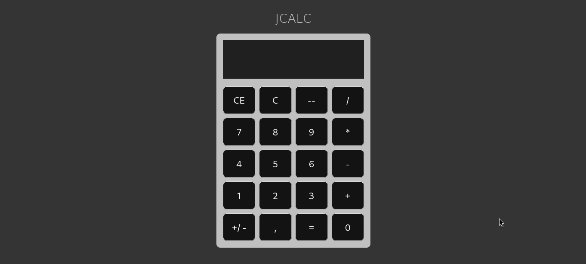
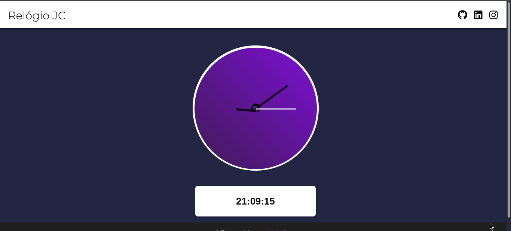
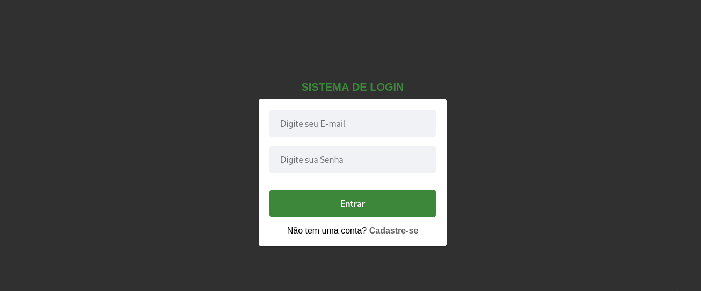
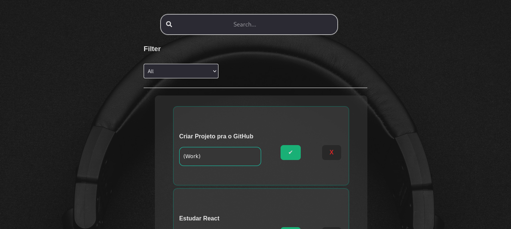

# Js learning journey

This repository is where I gather my first front-end projects, showcasing my journey from working with Vanilla JavaScript to exploring React.js. Each project reflects the learning process and experimentation with different technologies and tools, including JavaScript, HTML5, CSS3, and React, as well as modern build tools like Vite. These projects are stepping stones in my development path, highlighting key skills in DOM manipulation, state management, and creating dynamic user interfaces.

---

### 📦 Technologies Used

---

## 🔥 Featured Projects

### 📁 Vanilla JavaScript

1. **🧮 Calculator (Vanilla JS)**
   - Location: `/vanilla/js_calc`
   - Description: A simple calculator built with pure JavaScript, manipulating the DOM for interactions.
   - Technologies:   

   

2. **⏰ Dynamic Clock (Vanilla JS)**
   - Location: `/vanilla/js_clock`
   - Description: A digital clock made with JavaScript that updates in real-time.
   - Technologies:   
   
   

---

### 📁 React.js

1. **🔐 Basic Login System (React)**
   - Location: `/react/basic_login`
   - Description: A simple user authentication system built with React using the Context API for state management.
   - Technologies:  

   

2. **📝 To-Do List (React)**
   - Location: `/react/to-do_list`
   - Description: A to-do list app with features like adding, filtering, and searching tasks.
   - Technologies:  

   

---

## 🛠️ Technologies and Tools

During the development of these projects, I used a variety of tools and technologies:

- **React.js**: Framework for building dynamic, component-based user interfaces.
- **JavaScript (ES6+)**: Leveraging the latest language features like arrow functions, async/await, destructuring, etc.
- **Node.js**: Used for package management and build scripts.
- **HTML5 & CSS3**: The backbone for structure and style of web pages.
- **Bootstrap**: A framework for responsive layouts and styling.
- **Vite.js**: A modern build tool for fast and optimized React development.

---

## 🚀 Conclusion and Next Steps

This repository marks my learning journey in front-end development, and new projects will be added as I continue to explore and grow as a developer. Feel free to explore, suggest improvements, or even contribute ideas! 🎉

---

**Any questions or suggestions? Feel free to contact me!**